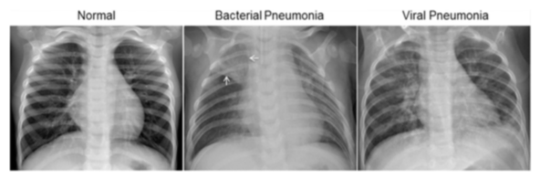

# MLOps-Course-Project

### **About the project**
This project is the final project at DTU [Technical University of Denmark](https://www.dtu.dk/) for the 3 Week January course [Machine Learning Operations](https://kurser.dtu.dk/course/02476) in 2022.

> Course material at [Github](https://skaftenicki.github.io/dtu_mlops/).

### **Authors**

* [David Anthony Parham](https://github.com/davelbit) (s202385)
* [Rian Leevinson](https://github.com/RianLeevinson) (s202540)
*  [Stefan Nahstoll](https://github.com/StefanNa) (s193647)
*  [Abhista Partal Balasubramaniam](https://github.com/AbhistaPB) (s210246)

## **Primary Project Objective**

The aim of this project is to familiarize ourselves with the use and best practices of the entire tech stack required for [Machine Learning Operations](https://en.wikipedia.org/wiki/MLOps).

### **This includes:**
- Running and tracking experiments ([wandb](https://wandb.ai))
- Code structure and ([cookiecutter](https://github.com/drivendata/cookiecutter-data-science), [formatters](https://github.com/psf/black), etc.)
- Working with config files ([hydra](https://hydra.cc/docs/configure_hydra/intro/), [OmegaConf](https://omegaconf.readthedocs.io/en/2.1_branch/index.html))
- Code and data versioning ([git](https://git-scm.com/), [dvc](https://dvc.org/))
- Containerization ([Docker](https://www.docker.com/))
- Working in the cloud ([Google Cloud Platform](https://console.cloud.google.com/))

## **Secondary Project Objective**

Construct Training, Testing and Validation sets from the [Mendeley Data](https://data.mendeley.com/datasets/jctsfj2sfn/1) and train a Convolutional Neural Network (CNN) to classify different X-Ray images of patient lungs as being infected with Covid-19, Pneumonia or no diseases (labeled as normal).

> Additionally we should try to incorporate the computer vision framework [Kornia](https://github.com/kornia/kornia) in a suitable way.

## **Sample images from the Mendeley Data**

Project Structure
------------

    ├── LICENSE
    ├── Makefile           <- Makefile with commands like `make data` or `make train`
    ├── README.md          <- The top-level README for developers using this project.
    ├── data
    │   ├── external       <- Data from third party sources.
    │   ├── interim        <- Intermediate data that has been transformed.
    │   ├── processed      <- The final, canonical data sets for modeling.
    │   └── raw            <- The original, immutable data dump.
    │
    ├── docs               <- A default Sphinx project; see sphinx-doc.org for details
    │
    ├── models             <- Trained and serialized models, model predictions, or model summaries
    │
    ├── notebooks          <- Jupyter notebooks. Naming convention is a number (for ordering),
    │                         the creator's initials, and a short `-` delimited description, e.g.
    │                         `1.0-jqp-initial-data-exploration`.
    │
    ├── references         <- Data dictionaries, manuals, and all other explanatory materials.
    │
    ├── reports            <- Generated analysis as HTML, PDF, LaTeX, etc.
    │   └── figures        <- Generated graphics and figures to be used in reporting
    │
    ├── requirements.txt   <- The requirements file for reproducing the analysis environment, e.g.
    │                         generated with `pip freeze > requirements.txt`
    │ 
    ├── config              <- Contains the config .yaml files for different constants and 
    │                          hyperparameters in the project.
    │
    ├── setup.py           <- makes project pip installable (pip install -e .) so src can be imported
    ├── src                <- Source code for use in this project.
    │   ├── __init__.py    <- Makes src a Python module
    │   │
    │   ├── data           <- Scripts to download or generate data
    │   │   └── make_dataset.py
    │   │
    │   ├── features       <- Scripts to turn raw data into features for modeling
    │   │   └── build_features.py
    │   │
    │   ├── models         <- Scripts to train models and then use trained models to make
    │   │   │                 predictions
    │   │   ├── predict_model.py
    │   │   └── train_model.py
    │   │
    │   └── visualization  <- Scripts to create exploratory and results oriented visualizations
    │       └── visualize.py
    │
    ├── setup.py           <- makes project pip installable (pip install -e .) so src can be imported
    │
    └── tox.ini            <- tox file with settings for running tox; s3ee tox.readthedocs.io

--------

<small>Project based on the <a target="_blank" href="https://drivendata.github.io/cookiecutter-data-science/">cookiecutter data science project template</a>. #cookiecutterdatascience</small>

###### Project directory structure is based on the [cookiecutter data science project template](https://drivendata.github.io/cookiecutter-data-science/). #cookiecutterdatascience</small>

